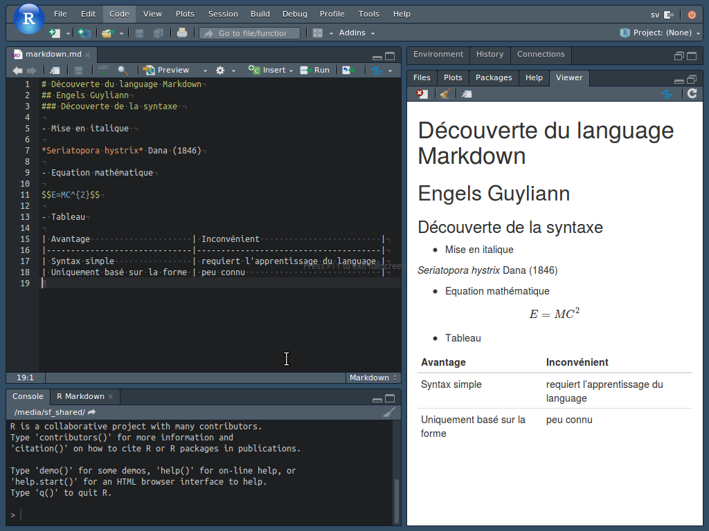

# Découverte du language Markdown
## Engels Guylian & Philippe Grosjean

Une fois votre machine virtuelle configurée, vous vous trouvez confronté à cet écran.

- Ajoutez le titre principal ^[Ajout d'une dièse devant le titre] 
- Ajoutez le titre secondaire secondaire ^[Ajout de deux dièses devant le titre]
- Ecrivez en italique le nom scientifiqeu de l'espèce de corail suivante: *Seriatopora hystrix* Dana (1846) ^[Ajout d'une astérique devant et derrière la partie de phrase à placer en italique]
- Ajoutez l'équation scientifique ci-dessous dans votre document^[Utilisation du symbole dollar devant et derrière l'équation. L'équation utilise le Latex ]

---

