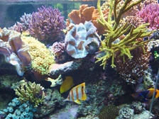

```{r setup, include=FALSE}
knitr::opts_chunk$set(echo = TRUE)
```

### Qui sommes-nous?

- Biologistes marins (coraux, plancton) à l'Université de Mons en Belgique.
- Développeurs en R (mainteneurs de 17 packages sur CRAN dont `tcltk2`, `mlearning`, `pastecs`, `zooimage`, `SciViews`, `svDialogs`, ...)




### Qui sommes-nous?

- Enseignants, y compris biostatistiques et science des données\
(voir http://biodatascience-course.sciviews.org)


---

\begin{center}
En observant nos étudiants, nous en déduisons les aspects les plus difficiles dans l'apprentissage de R, et nous réfléchissons ensuite à la façon de les simplifier.

Deux exemples seront détaillés ici.
\end{center}


### Courbe d'apprentissage de R


### Courbe d'apprentissage de R avec `Tidyverse`


### Courbe d'apprentissage idéale


### Courbe d'apprentissage idéale


---

\begin{center}
\Huge
\alert{Partie I : faciliter les graphiques R pour les débutants (package chart)}
\break
\break
\includegraphics[width=.3\linewidth]{figures/hex_chart.png}
\end{center}


### Graphiques sous R

- Trois moteurs graphiques principaux **base R**, **lattice** & **ggplot2 (tidyverse)**

- Rendu différent, syntaxe différente, incompatibilités

- **ggplot2** comme première approche (cf. David Robinson)


### Graphiques sous R - difficultés évitables pour les débutants {.fragile}

- Aucun des 3 moteurs graphiques principaux de R n'est simple (reflet de leurs nombreuses possibilités), mais...

. . .

1. Est-il possible de limiter les différences visuelles (thèmes homogènes) ?

. . .

2. Est-il possible de rendre leurs interfaces respectives un peu plus cohérentes ?

. . .

3. Est-il possible de les assembler en figures composites ?

. . .

_Voyons ensemble avec un exemple très simple d'une analyse par régression linéaire et le package `chart` quelques pistes d'amélioration des 3 points précédents._


### Analyse de la masse de squelette d'oursins

Jeu de données `urchin_bio` dans le package `data` chargé avec sa fonction `read()` (jeu de données) **enrichi** de métadonnées (e.g., **label** et **unités** des variables dans différentes langues) :

```{r}
#install.packages("devtools")
#devtools::install_github("SciViews/data")
urchin <- data::read("urchin_bio", package = "data", lang = "FR")
```

Nous aurons besoin aussi de `tidyverse`, `chart` et de leurs dépendances :

```{r eval=FALSE}
#install.packages(c("tidyverse", "latticeExtra", "cowplot",
#  "pryr", "ggpubr", "ggplotify"))
#devtools::install_github("SciViews/chart")
library(tidyverse)
library(chart)
```

```{r message=FALSE, warning=FALSE, include=FALSE}
library(tidyverse)
library(chart)
```

_Mettons-nous maintenant dans la peau d'un débutant qui découvre les outils nécessaires pour analyser ces données..._


### Premier graphique avec `ggplot2`

\begincols
\begincol{.64\textwidth}

```{r fig.align="center", warning=FALSE}
ggplot(data = urchin, aes(weight, skeleton)) +
  geom_point()
```

\endcol
\begincol{.32\textwidth}

**Code facile à comprendre et résultat très plaisant, mais...**

\vfill

- Libellés des axes par défaut sub-optimaux (unités manquantes)
- Thème gris particulier (distingue `ggplot2` des 2 autres)

\endcol
\endcols


### Premier graphique, version `chart`

\begincols
\begincol{.64\textwidth}

```{r fig.align="center", warning=FALSE}
chart(data = urchin, aes(weight, skeleton)) +
  geom_point()
```

\endcol
\begincol{.32\textwidth}

**Règle `chart` #1 : `chart()` peut simplement remplacer `ggplot()`.**

\vfill

- Substitution facile à retenir
- Labels des axes et unités automatiques (si renseignés dans le jeu de données)
- Thème plus proche du "publication-ready"

\endcol
\endcols


### Suite logique de l'analyse : régression linéaire

\begincols
\begincol{.64\textwidth}

```{r comment="", warning=FALSE}
(lmod <- lm(data = urchin, skeleton ~ weight))
```

\endcol
\begincol{.32\textwidth}

**Pattern non compatible avec celui du graphique.**

- `aes(<x>, <y>)` _versus_ `<y> ~ <x>`

- Approche Tidyverse _versus_ formula

- Inversion de la position des variables

_Comment simplifier vers un pattern unique?_

\endcol
\endcols


### Utilisation de formules avec `chart`

\begincols
\begincol{.64\textwidth}

```{r fig.align="center", warning=FALSE}
chart(data = urchin, skeleton ~ weight) +
  geom_point()
```

\endcol
\begincol{.32\textwidth}

**Règle `chart` #2: une formule est utilisable à la place de `aes()`.**

\vfill

- Convergence vers un pattern identique graphe/modèle dans les cas simples :

`<fun>(data = <df>, <formula>)`

\endcol
\endcols


### `chart$<fun>()` compatible avec lattice et base plots

\begincols
\begincol{.64\textwidth}

```{r fig.align="center", warning=FALSE}
chart$xyplot(data = urchin, skeleton ~ weight)
```

\endcol
\begincol{.32\textwidth}

**Règle `chart` #3: `chart$<fun>()` permet de varier le type de graphique, y compris base ou lattice !**

\vfill

- Le pattern reste très semblable :

`<fun>$<type>(data = <df>, <formula>)`

- Thèmes `ggplot2` / `lattice` / `base` homogènes

\endcol
\endcols


### Ajout de la droite de régression

```{r fig.align="center", warning=FALSE}
chart(data = urchin, skeleton ~ weight) +
  geom_point() +
  geom_smooth(method = "lm")
```


### Suite de l'analyse : graphe des résidus

\begincols
\begincol{.64\textwidth}

```{r fig.align="center", warning=FALSE}
par(mfrow = c(1L, 2L))
plot(lmod, which = 1L)
plot(lmod, which = 2L)
# Comment ajouter???
#chart$geom_point(data = urchin, skeleton ~ weight) +
#  geom_smooth(method = "lm")
```

\endcol
\begincol{.32\textwidth}

Analyse des résidus de `lm()` => graphiques de base

\vfill

_Comment combiner avec le graphe `ggplot2` précédent dans une figure composite ?_

\endcol
\endcols


### Compatibilité des graphiques `chart` base/lattice/ggplot2 entre eux

Le problème ne se pose plus avec `chart()` : tous les graphes sont compatibles entre eux pour l'assemblage en une figure composite. Démonstration :

```{r eval=FALSE}
# ggplot2
c1 <- chart$geom_point(data = urchin, skeleton ~ weight) +
  geom_smooth(method = "lm")
# Lattice plot
c2 <- chart$xyplot(data = urchin, skeleton ~ weight | origin)
# Base plots
c3 <- chart$plot(lmod, which = 1L)
c4 <- chart$plot(lmod, which = 2L)
```

```{r warning=FALSE, include=FALSE}
# ggplot2
c1 <- chart(data = urchin, skeleton ~ weight) +
  geom_point() +
  geom_smooth(method = "lm") +
  theme(plot.margin = margin(0.8, 0.5, 0.3, 0.8, "cm"))
# Lattice plot
c2 <- chart$xyplot(data = urchin, skeleton ~ weight | origin,
  pch = 16, col = "black", xlab = "Masse totale [g]", ylab = "Masse du squelette [g]", scales = list(alternating = 1))
# Base plots
c3 <- chart$plot(lmod, which = 1L,
  pch = 16, las = 1, cex.axis = 0.8)
c4 <- chart$plot(lmod, which = 2L,
  pch = 16, las = 1, cex.axis = 0.8)
```

---

```{r warning=FALSE, fig.align="center", fig.width = 8, fig.height = 4.5}
ggarrange(c1, c2, c3, c4, labels = "AUTO")
```


### A retenir...

- Les graphiques `chart` peuvent tous être assemblés en une figure composite, qu'ils soient `ggplot2`, graphes de base ou `lattice` _(fini)_

- Les formules sont aussi utilisables avec `ggplot2` en utilisant `chart()` _(fini)_

- Les thèmes des 3 moteurs graphiques sont homogénéisés le plus possible avec `chart` _(encore perfectible)_

- Si des attributs `label` et `units` existent, ils sont utilisés pour de meilleurs labels des axes _(reste à implémenter pour `lattice` et graphes de base)_

_Travail en cours... d'autres idées d'améliorations sont les bienvenues, pull request sur https://github.com/SciViews/chart, s'il-vous-plait !_

---

\begin{center}
\Huge
\alert{Partie II : faciliter la réutilisation de pipelines \& tidy évaluation (package flow)}
\break
\break
\includegraphics[width=.3\linewidth]{figures/hex_flow.png}
\end{center}


### Pipeline dans Tidyverse {.fragile}

Voici un exemple de pipeline simple avec `%>%` :

\begincols
\begincol{.48\textwidth}

```{r}
urchin %>%
  mutate(lgsk = log(skeleton)) %>%
  summarise(mean = mean(lgsk,
    na.rm = TRUE))
```

\endcol
\begincol{.48\textwidth}

\break

\endcol
\endcols

. . .

_Comment transformer ce pipeline en fonction réutilisable ?_

- Nécessité de maîtriser le mécanisme "tidyeval" de tidyverse => barrière technologique qu'il serait souhaitable de limiter

- Approche par le package `flow` :

```{r eval=FALSE}
#devtools::install_github("SciViews/flow")
library(flow)
```

```{r message=FALSE, warning=FALSE, include=FALSE}
library(flow)
```


### Création d'un objet `flow` : permet d'inclure des variables dans le pipeline {.fragile}

\begincols
\begincol{.48\textwidth}

**Tidyverse**

```{r eval=FALSE}
#
x <- quo(skeleton)
urchin %>%
  mutate(lgsk = log(!!x)) %>%
  summarise(mean = mean(lgsk,
    na.rm = TRUE))
```

\endcol

. . .

\begincol{.48\textwidth}

**flow**

```{r eval=FALSE}
flow(urchin,
  x_ = skeleton
) %>_%
  mutate(., lgsk = log(x_)) %>_%
  summarise(., mean = mean(lgsk,
    na.rm = TRUE)) %>_% .
```

\endcol
\endcols

#### La variable `x_` est incluse dans l'objet `flow`

- Elle ne **"pollue" pas l'environnement** où le pipeline est exécuté, contrairement à ce qui se passe à gauche dans la forme classique

- Opérateur préfixé `!!` (tidyeval) de **tidyverse** est remplacé par l'"opérateur" `_` suffixé dans `flow`

- Le passage d'expressions via les `quosure`s devient transparent avec l'"opérateur" suffixé `_` dans `flow`

- la spécification de l'expression est largement simplifiée (pas besoin de `quo()` ou `enquo()`, objectif premier de l'utilisation de l'évaluation non standard !)


### Variable comme nom d'argument (cas plus difficile) {.fragile}

\begincols
\begincol{.48\textwidth}

**Tidyverse**

```{r eval=FALSE}
#
x <- quo(skeleton)
y <- "lgsk"
y_quo <- as.quosure(as.name(y))
urchin %>%
  mutate(!!y := log(!!x)) %>%
  summarise(mean = mean(!!y_quo,
    na.rm = TRUE))
```

\endcol

. . .

\begincol{.48\textwidth}

**flow**

```{r eval=FALSE}
flow(urchin,
  x_ = skeleton,
  y_ = lgsk
  
) %>_%
  mutate(., y_ = log(x_)) %>_%
  summarise(., mean = mean(y_,
    na.rm =TRUE)) %>_% .
```

\endcol
\endcols

#### La définition d'un nom de variable et son utilisation ensuite dans un pipeline est beaucoup plus simple avec `flow`

- Une seule variable (`y_`) au lieu de deux (`y` (`character`) et `y_quo` (`quosure`))!

- Pas d'obligation de remplacer `=` par `:=` pour conserver une syntaxe R correcte


### Fonction réutilisable depuis un pipeline ("séquence fonctionnelle") {.fragile}

\begincols
\begincol{.48\textwidth}

**Tidyverse**

```{r eval=FALSE}
#
x <- quo(skeleton)
y <- "lgsk"
y_quo <- as.quosure(as.name(y))
foo <- . %>%
  mutate(!!y := log(!!x)) %>%
  summarise(mean = mean(!!y_quo,
    na.rm = TRUE))
# Utilisation
foo(urchin)
```

\endcol

. . .

\begincol{.48\textwidth}

**flow**

```{r eval=FALSE}
foo <- function(.,
  x_ = skeleton,
  y_ = lgsk
  
) enflow(.) %>_%
  mutate(., y_ = log(x_)) %>_%
  summarise(., mean = mean(y_,
    na.rm = TRUE)) %>_% .
# Utilisation, autre variable
foo(urchin, x_ = weight)
```

\endcol
\endcols

#### Seul `flow` permet d'inclure d'autres variables dans la séquence fonctionnelle `foo`

- La fonction est créée de manière explicite avec `function()`

- Le pipeline commence par `enflow()`


### A retenir...

- Les objets `flow` contiennent tout ce qui est nécessaire au pipeline, y compris des variables satellites éventuelles

- Le mécanisme "tidyeval" de tidyverse est beaucoup plus facile à implémenter et quasi-totalement transparent avec la convention `<var>_` ("opérateur" suffixé `_`) de `flow`

- Le passage d'un pipeline `flow()` avec variables satellites à une fonction réutilisable se fait de manière explicite en utilisant `function()` et `enflow()`

- La transition pipeline tidyverse à usage unique vers la fonction réutilisable est graduelle et bien plus facile avec `flow`

**Un useR devient un developeR en douceuR !**

_En cours de finalisation et soumission à CRAN... les contributions sont les bienvenues, pull request sur https://github.com/SciViews/flow, s'il-vous-plait !_


### Merci

Présentation et version plus détaillée sous forme de tutorial R Notebook disponibles à 

https://github.com/SciViews/RencontresRRennes2018


**Avez-vous des questions ?**


