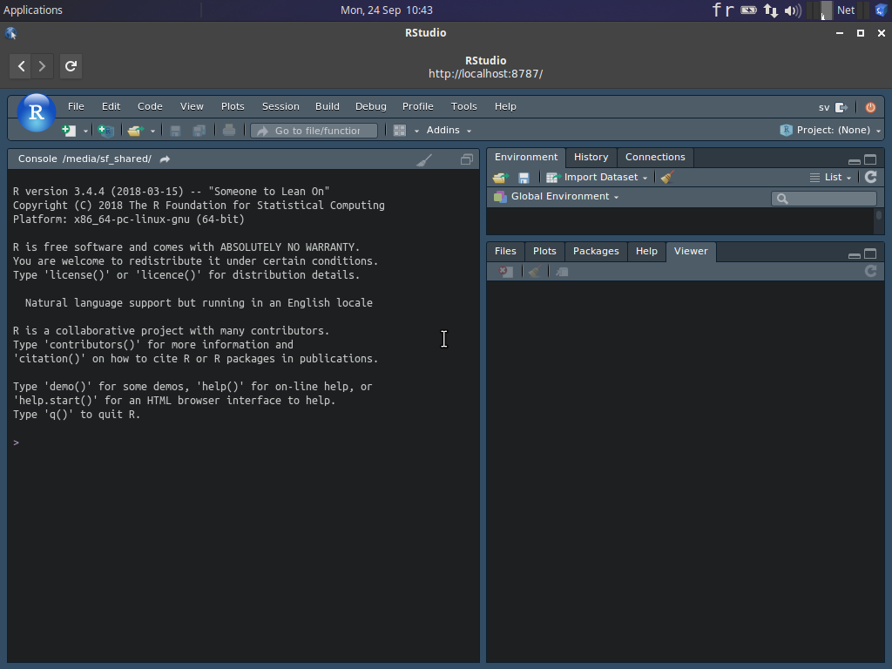

```{r setup, include=FALSE}
knitr::opts_chunk$set(echo = TRUE)
SciViews::R
```

### Découverte du markdown



___

- Créez un nouveau document `File -> New File -> Text File`

- Enregistrez ce document dans `shared -> projects` 

- Nommez le `markdown.md`

___

- Ajoutez le titre principal 
    +  Ecrivez : Découverte du language Markdown

___

- Ajoutez le titre secondaire secondaire
    +  Ecrivez : Nom et prénom 

___


- Ajoutez un titre de niveau plus bas 
    +  Ecrivez : *Seriatopora hystrix* Dana (1846)

Attention, respectez la mise en italique 

___

- Ajoutez l'équation scientifique ci-dessous dans votre document

$$E = MC^2$$

- Ajoutez un tableau comprennant les avantages et inconvénients du language markdown


___

**Astuces**

- `EqualX` permet d'écrire facilement des équations complexes qu'il suffit de copier-coller dans le document markdown/

- `Table Editor` permet d'écrire facilement des tableau en markdown. 
