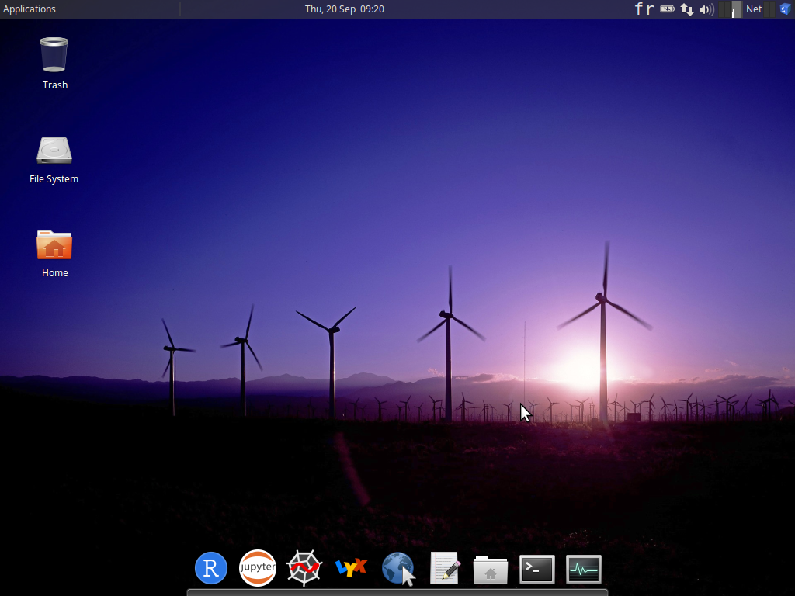

```{r setup, include=FALSE}
knitr::opts_chunk$set(echo = TRUE)
SciViews::R
```

### Découverte du logiciel R



___

- Trouvez une application permettant d'écrire des équations méthamatiques

$$2H_2 + O_2 \xrightarrow{n,m}2H_2O$$

___

- Trouvez une application permettant de trouver des charactères spéciaux

___

- Trouvez une application permettant de visualiser l'occupation de l'espace sur le disque 
    + Quel dossier occupe le plus de place sur le disque `box2018a` ? 
    + Au sein de ce dossier, quel dossier occupe le plus de place ?
    + Au sein de ce second dossier, quel dossier occupe le plus de place ? 
    
___

- Employer l'application `Moussepad` pour écrire la phrase suivante :

> **Je découvre les applications présentes dans la SciViews Box 2018.**

- Sauvegardez votre fichier dans le dossier document avec le nom suivant `dossier_partage.txt`

___

- Recherchez votre fichier `dossier_partage.txt` dans votre ordinateur hôte et notez la position du fichier.

___

- Déplacez le fichier `dossier_partage.txt` sur le bureau de la machine virtuelle.

- Déplacez à nouveau ce fichier dans le dossier `shared` et le sous dossier `project`. Qu'observez vous ? 

___

- Recherchez à nouveau votre fichier `dossier_partage.txt` dans votre ordinateur hôte et notez la position du fichier.

