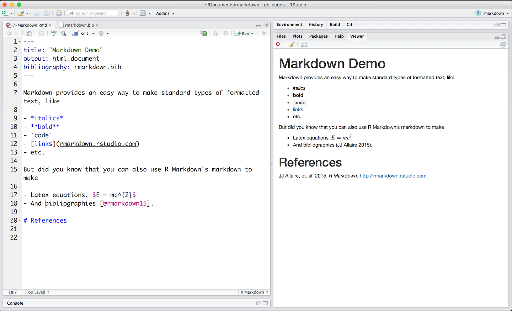
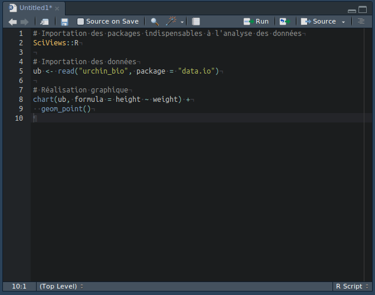
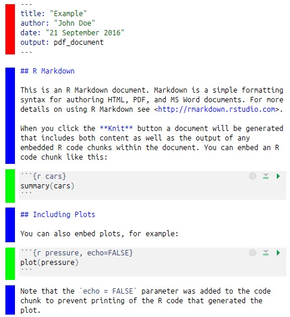

```{r setup, include=FALSE}
knitr::opts_chunk$set(echo = TRUE)
SciViews::R
ub <- read("urchin_bio", package = "data.io")
is <- read("iris", package = "datasets")
```

### Découverte du logiciel R


___


___


___


Insérez les instructions suivantes dans la console R

```{r, eval = FALSE}
BioDataScience::run("02a_r_decouverte")
```

### Réalisation de nuage de points

\begincols
\begincol{.64\textwidth}

```{r, fig.align="center", echo = FALSE, warning=FALSE, message=FALSE}
chart(ub,formula = height ~  weight) + 
  geom_point() +
  labs( x = "Label de l'axe x  + [Unité]", 
        y = "Label de l'axe y + [Unité]") +
  theme(axis.text.x = element_text(colour = "#a80039", size = 15), 
        axis.title.x = element_text(colour = "#029687", size = 15), 
        axis.text.y = element_text(colour = "#a80039", size = 15), 
        axis.title.y = element_text(colour = "#029687", size = 15),
        axis.line.x = element_line(colour = "#a80039"),
        axis.line.y = element_line(colour = "#a80039"),
        )
```

\endcol
\begincol{.32\textwidth}

**Les éléments indispensables : **

\vfill

- Les axes avec les graduations (en rouge)
- les labels et les unités des axes (en bleu)


\endcol
\endcols

___

```{r}
chart(ub, formula = height ~ weight) +
  geom_point()
```

### Utilisation de R Markdown

**Markdown** : language très simples



___

**R** : suite d'instructions



___

\begincols
\begincol{.64\textwidth}



\endcol
\begincol{.32\textwidth}

**Description**

\vfill

\vfill

\vfill


- Préambule (Rouge)

- Markdown (Bleu)

- Chunks, R code (Vert)

- Markdown (Bleu)

- Chunks, R code (Vert)

- Markdown (Bleu)

\endcol
\endcols

### Comparaison de workflow 


\begincols
\begincol{.34\textwidth}

**Excel - Word**

\vfill

\vfill


{width="80"}

{width="80"}

- biometry_2014_ew
- biometry_2016_ew

\endcol
\begincol{.32\textwidth}

**R Markdown**

\vfill

\vfill


{width="100"}

- biometry_2014
- biometry_2016

\endcol
\endcols

Quel format d'analyse vous semble le plus approprié dans la recherche scientifique et collaborative ? 
