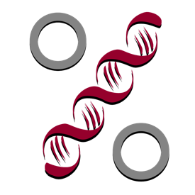

    ## ── Conflicts ─────────────────────────────────────────────────── tidyverse_conflicts() ──
    ## ✖ dplyr::filter()                  masks stats::filter()
    ## ✖ dplyr::lag()                     masks stats::lag()
    ## ✖ chart::scale_color_continuous()  masks ggplot2::scale_color_continuous()
    ## ✖ chart::scale_colour_continuous() masks ggplot2::scale_colour_continuous()
    ## ✖ chart::scale_fill_continuous()   masks ggplot2::scale_fill_continuous()
    ## ✖ dplyr::select()                  masks MASS::select()

Exercice du cours de [Science des Données Biologiques I de l'Université de Mons, module 05](http://biodatascience-course.sciviews.org/sdd-umons/import.html).



Objectif
--------

-   Vous exercer à la manipulation des données sur le jeu de données `biometry`.

Procédure
---------

Reprenez votre projet sur l'étude du zooplancton et complétez votre rapport, ou ouvrez un document R Markdown séparé pour répondre aux challenges suivants. Utilisez la version *complètement* francisée du jeu de données, importé à l'aide de l'instruction :

``` r
(biometry <- read("biometry", package = "BioDataScience", lang = "FR"))
```

    ## # A tibble: 395 x 7
    ##    gender day_birth  weight height wrist year_measure   age
    ##    <fct>  <date>      <dbl>  <dbl> <dbl>        <dbl> <dbl>
    ##  1 H      1995-03-11     69    182  15           2013    18
    ##  2 H      1998-04-03     74    190  16           2013    15
    ##  3 H      1967-04-04     83    185  17.5         2013    46
    ##  4 H      1994-02-10     60    175  15           2013    19
    ##  5 F      1990-12-02     48    167  14           2013    23
    ##  6 F      1994-07-15     52    179  14           2013    19
    ##  7 F      1971-03-03     72    167  15.5         2013    42
    ##  8 F      1997-06-24     74    180  16           2013    16
    ##  9 H      1972-10-26    110    189  19           2013    41
    ## 10 H      1945-03-15     82    160  18           2013    68
    ## # ... with 385 more rows

A chaque fois, utiliser un chainage des opérations lorsque cela se justifie et prenez soin à écrire un code **clair**, **lisible**, et qui utilise les fonctions *ad hoc* de manière optimale (recherchez une solution concise et efficace).

Procédure
---------

-   Sur base de la variable portant sur la date de naissance (day\_birth) et la variable portant sur l'année de la mesure (year\_measure), tenter d'obtenir l'age des individus lors de la prise de mesure. Vos résultats doivent donc être identique avec la variable exprimant l'age des individus (Age)

-   Calculer l'IMC dans la population étudiée et créez une variable afin d'y associer l'interprétation fournie par l'OMS.

| IMC (kg/m2)      |           Interprétation (selon l’OMS)          |
|:-----------------|:-----------------------------------------------:|
| Inférieur 18.5   |      Sous-poids (en anglais `underweight`)      |
| Entre 18.5 et 25 | Corpulence normale (en anglais `normal weight`) |
| Entre 25 et 30   |        Surpoids (en anglais `overweight`)       |
| Supérieur à 30   |           Obésité (en anglais `obese`)          |

Dénombrez le nombre d'homme et de femme dans chacune de ces catégories. Présentez ce tableau correctement dans le document R Markdown (formattage et légende du tableau). Choississez ensuite le graphique le plus adapté et ajoutez lui une légende pour représenter graphiquement votre tableau.

-   Séparez votre jeu de données en deux sur base de l'âge des individus. Justifier votre séparation à l'aide du graphique le plus adéquats. Ajoutez une variable à votre jeu de données pour renseigner cette distinction. Vérifiez si vos groupes ont une abondance similaire et Décrivez la situation à l'aide d'un tableau.
